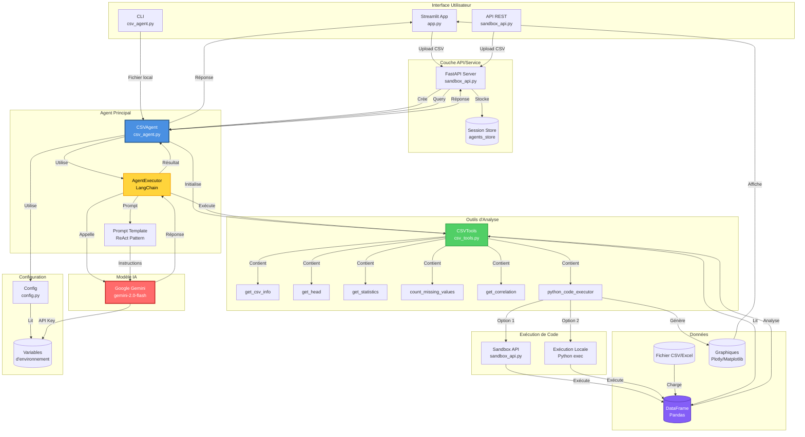
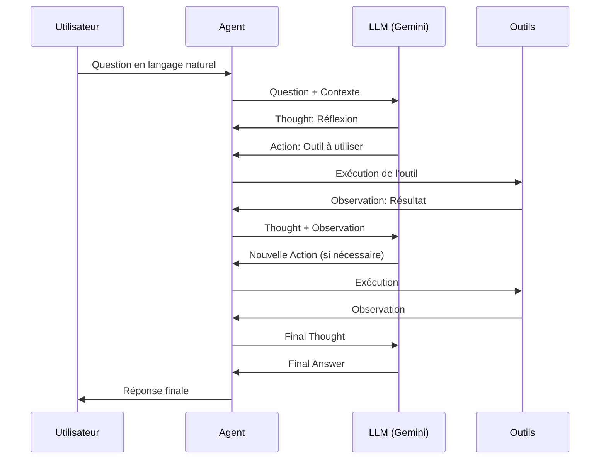

# Architecture de l'Agent CSV

## Vue d'ensemble

L'agent CSV est un système d'analyse de données basé sur l'IA qui permet d'interroger des fichiers CSV/Excel en langage naturel. Il utilise le pattern ReAct (Reasoning + Acting) avec le modèle Gemini de Google.

## Schéma d'architecture

## Composants principaux

### 1. **Interface Utilisateur** (Couche Présentation)
- **Streamlit App** (`app.py`) : Interface web interactive avec chat
- **API REST** (`sandbox_api.py`) : Endpoints FastAPI pour intégration
- **CLI** (`csv_agent.py`) : Mode ligne de commande interactif

### 2. **Agent Principal** (Couche Logique Métier)
- **CSVAgent** : Classe principale orchestrant l'analyse
- **AgentExecutor** : Exécuteur LangChain gérant le cycle ReAct
- **Prompt Template** : Instructions détaillées pour l'agent (expert en séries temporelles)

### 3. **Outils d'Analyse** (Couche Fonctionnelle)
- **CSVTools** : Collection d'outils LangChain
  - `get_csv_info` : Informations sur la structure
  - `get_head` : Aperçu des données
  - `get_statistics` : Statistiques descriptives
  - `count_missing_values` : Détection de valeurs manquantes
  - `get_correlation` : Analyse de corrélations
  - `python_code_executor` : Exécution de code Python personnalisé

### 4. **Exécution de Code** (Couche Sécurité)
- **Sandbox API** : Exécution sécurisée via API externe (optionnel)
- **Exécution Locale** : Exécution directe avec environnement isolé

### 5. **Modèle IA** (Couche Intelligence)
- **Google Gemini 2.0 Flash** : Modèle de langage pour compréhension et raisonnement

### 6. **Données** (Couche Persistance)
- **Fichiers CSV/Excel** : Données sources
- **DataFrame Pandas** : Représentation en mémoire
- **Graphiques** : Visualisations Plotly/Matplotlib

## Flux de traitement

### Cycle ReAct (Reasoning + Acting)

## Technologies utilisées

| Composant | Technologie |
|-----------|-------------|
| **Framework IA** | LangChain |
| **Modèle LLM** | Google Gemini 2.0 Flash |
| **Interface Web** | Streamlit |
| **API REST** | FastAPI |
| **Analyse de données** | Pandas, NumPy |
| **Visualisation** | Plotly, Matplotlib |
| **Configuration** | python-dotenv |

## Points clés de l'architecture

1. **Pattern ReAct** : L'agent raisonne avant d'agir, permettant une analyse itérative
2. **Outils modulaires** : Chaque fonction d'analyse est un outil LangChain indépendant
3. **Exécution flexible** : Support de l'exécution locale et sandbox pour la sécurité
4. **Multi-interface** : Support CLI, Web (Streamlit) et API REST
5. **Gestion de sessions** : L'API REST maintient des sessions pour plusieurs utilisateurs
6. **Spécialisation temporelle** : L'agent est spécialement optimisé pour les séries temporelles

## Configuration

Les paramètres sont centralisés dans `config.py` :
- Modèle : `gemini-2.0-flash`
- Max itérations : 5
- Timeout : 30s
- Délai entre appels LLM : 1.5s (pour éviter les erreurs 429)

## Sécurité

- Exécution de code dans un environnement isolé
- Support optionnel d'une API sandbox externe
- Validation des types de fichiers (CSV/Excel uniquement)
- Gestion des erreurs et timeouts

