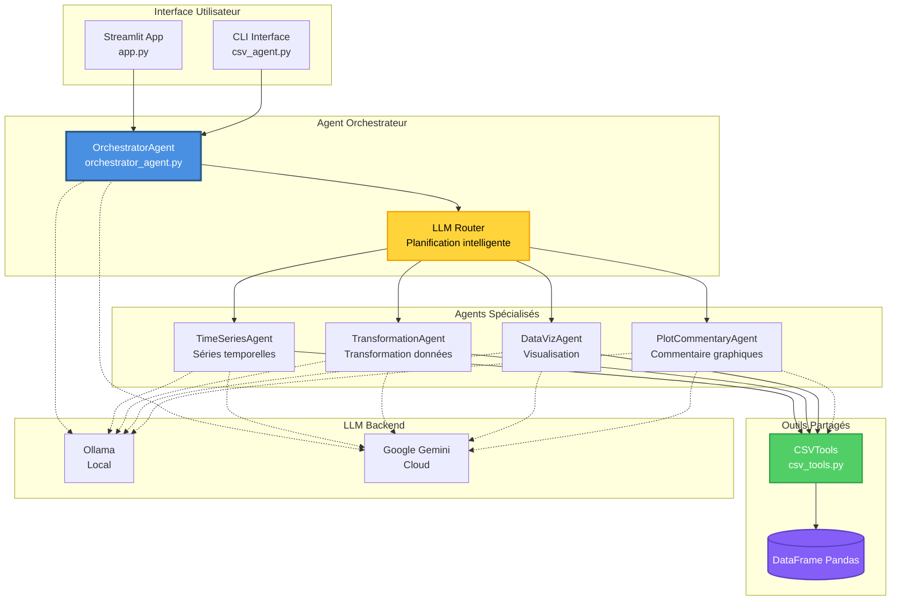
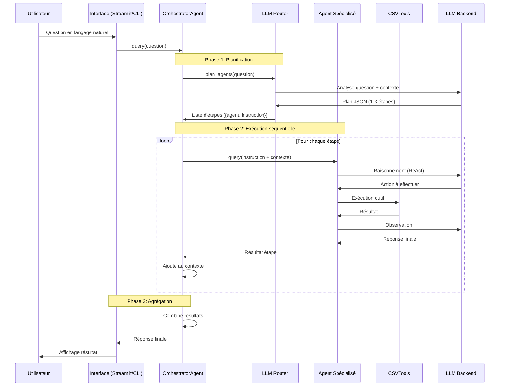
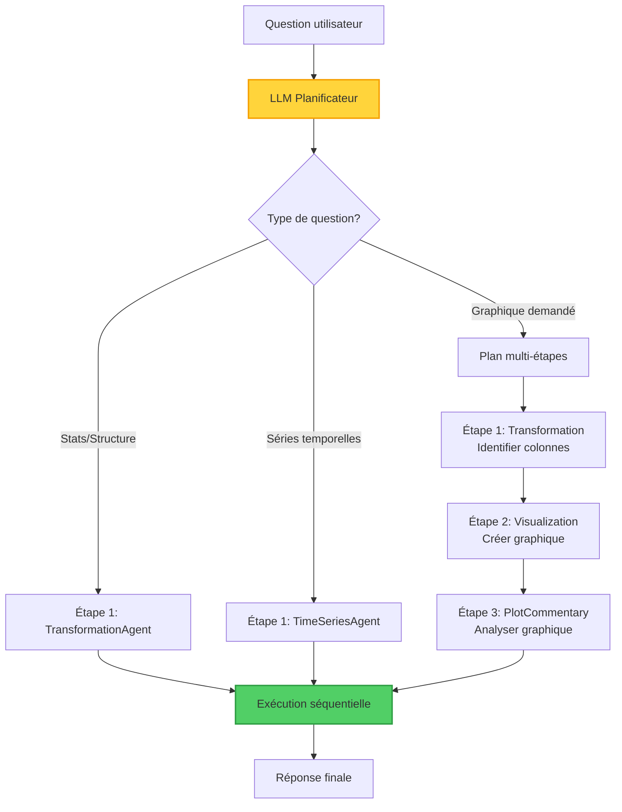
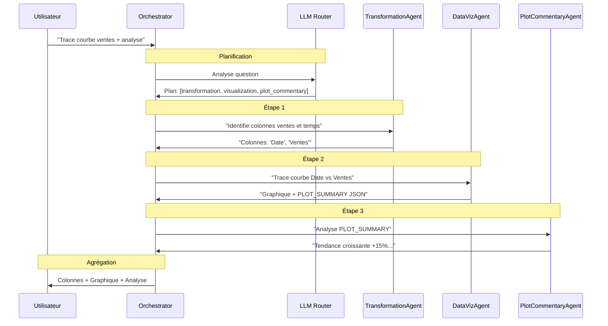

# Structure du Projet et Workflow de l'Agent CSV

## 📁 Structure du Projet

```
csv_agent_project/
├── 📂 agents/                          # Agents spécialisés
│   ├── __init__.py
│   ├── orchestrator_agent.py          # Agent orchestrateur (routing)
│   ├── time_series_agent.py           # Agent séries temporelles
│   ├── transformation_agent.py        # Agent transformation de données
│   ├── data_viz_agent.py              # Agent visualisation
│   └── plot_commentary_agent.py       # Agent commentaire de graphiques
│
├── 📂 plots/                           # Graphiques générés
│
├── 📄 app.py                           # Application Streamlit (interface web)
├── 📄 csv_agent.py                     # Interface principale de l'agent
├── 📄 csv_tools.py                     # Outils d'analyse CSV (33k lignes)
├── 📄 llm_factory.py                   # Factory pour LLM (Ollama/Gemini)
├── 📄 config.py                        # Configuration globale
├── 📄 callbacks.py                     # Callbacks LangChain
├── 📄 plot_registry.py                 # Registre des graphiques
│
├── 📄 ARCHITECTURE.md                  # Documentation architecture
├── 📄 MULTI_AGENT_ARCHITECTURE.md      # Documentation multi-agents
├── 📄 LLM_USAGE_EXPLANATION.md         # Explication utilisation LLM
├── 📄 README.md                        # Documentation principale
│
├── 📄 requirements.txt                 # Dépendances Python
├── 📄 .env                             # Variables d'environnement
├── 📄 .gitignore
│
└── 📂 fichiers de test/                # Fichiers de test et reproduction
    ├── test_*.py
    ├── reproduce_*.py
    ├── verify_*.py
    └── temp_*.csv/xlsx
```

## 🏗️ Architecture Multi-Agents

### Vue d'ensemble



## 🔄 Workflow de l'Agent

### 1. Flux Principal de Traitement



### 2. Planification Intelligente (LLM Router)

L'**OrchestratorAgent** utilise un LLM pour planifier 1 à 3 étapes :



**Règles de planification** :
- ✅ Ajoute `visualization` **UNIQUEMENT** si graphique explicitement demandé
- ✅ Si colonnes non spécifiées → `transformation` d'abord pour identifier
- ✅ Si `visualization` présente → ajoute `plot_commentary` après
- ✅ Maximum 3 étapes pour éviter la complexité

### 3. Agents Spécialisés et Leurs Outils

#### 🔵 TransformationAgent
**Rôle** : Analyse structure, statistiques, corrélations

**Outils disponibles** :
- `get_csv_info` - Informations générales (colonnes, types, taille)
- `get_head` - Aperçu des premières lignes
- `get_statistics` - Statistiques descriptives
- `count_missing_values` - Détection valeurs manquantes
- `get_correlation` - Matrice de corrélation
- `create_column` - Création de nouvelles colonnes

**Exemples de questions** :
- "Quelle est la structure du fichier ?"
- "Affiche les statistiques de la colonne Prix"
- "Y a-t-il des valeurs manquantes ?"

#### 🟢 TimeSeriesAgent
**Rôle** : Analyse temporelle, tendances, agrégations

**Outils disponibles** :
- `detect_time_columns` - Détection colonnes temporelles
- `prepare_time_series` - Fusion date/heure
- `calculate_trend` - Calcul tendances
- `calculate_moving_average` - Moyennes mobiles
- `aggregate_by_period` - Agrégation par période
- `detect_anomalies` - Détection anomalies

**Exemples de questions** :
- "Quelle est la tendance des ventes ?"
- "Calcule la moyenne mobile sur 7 jours"
- "Agrège par mois"

#### 🟣 DataVizAgent
**Rôle** : Création de visualisations

**Outils disponibles** :
- `plot_line` - Graphique en ligne
- `plot_scatter` - Nuage de points
- `plot_bar` - Graphique en barres
- `plot_histogram` - Histogramme
- `plot_correlation_heatmap` - Heatmap corrélation

**Exemples de questions** :
- "Trace une courbe des ventes dans le temps"
- "Fais un histogramme des prix"
- "Montre la corrélation entre les colonnes"

#### 🟡 PlotCommentaryAgent
**Rôle** : Analyse et commente les graphiques

**Fonctionnement** :
- Reçoit le `PLOT_SUMMARY` JSON du DataVizAgent
- Génère une analyse courte (5-8 lignes)
- Identifie tendances, extrêmes, relations

## 🔧 Composants Techniques

### CSVTools (csv_tools.py)
**Taille** : 33,891 octets (33k lignes)

**Responsabilités** :
- Chargement CSV/Excel avec détection automatique
- Gestion du DataFrame Pandas partagé
- Implémentation de tous les outils d'analyse
- Exécution de code Python personnalisé
- Génération de graphiques (Plotly/Matplotlib)

### LLM Factory (llm_factory.py)
**Responsabilités** :
- Détection automatique Ollama (local) vs Gemini (cloud)
- Configuration des modèles (température, tokens, retries)
- Gestion des clés API
- Fallback automatique si un backend indisponible

**Modèles supportés** :
- **Ollama** : `qwen2.5:7b` (local, gratuit)
- **Gemini** : `gemini-2.0-flash-exp` (cloud, API key requise)

### Configuration (config.py)
**Paramètres clés** :
```python
MODEL_NAME = "qwen2.5:7b"  # ou gemini-2.0-flash-exp
MAX_ITERATIONS = 5
TIMEOUT = 30
LLM_REQUEST_DELAY = 1.5  # Évite erreurs 429
```

## 📊 Exemple de Workflow Complet

### Question : "Trace une courbe des ventes dans le temps et analyse la tendance"



**Résultat final** :
1. ✅ Identification des colonnes pertinentes
2. ✅ Graphique interactif Plotly
3. ✅ Analyse textuelle de la tendance

## 🚀 Points Clés de l'Architecture

### Avantages Multi-Agents

| Avant (Mono-agent) | Après (Multi-agents) |
|-------------------|---------------------|
| ❌ 1 agent, 25+ outils | ✅ 5 agents spécialisés |
| ❌ Prompt très long | ✅ Prompts courts et ciblés |
| ❌ Confusion entre outils | ✅ Outils pertinents uniquement |
| ❌ Difficile à maintenir | ✅ Modulaire et extensible |
| ❌ Beaucoup d'itérations | ✅ Moins d'itérations |

### Partage de Ressources
- **CSVTools** : Instance unique partagée par tous les agents
- **DataFrame** : Même données en mémoire pour tous
- **LLM Counter** : Compteur partagé pour tracking

### Gestion de Contexte
- Chaque étape ajoute son résultat au contexte
- L'étape suivante reçoit tout le contexte précédent
- Permet la composition d'analyses complexes

## 📝 Utilisation

### Interface Streamlit (Web)
```bash
streamlit run app.py
```

### Interface CLI
```python
from csv_agent import CSVAgent

agent = CSVAgent("data.csv", verbose=True)
response = agent.query("Quelle est la tendance des ventes ?")
print(response)
```

## 🔍 Monitoring et Debug

### Mode Verbose
Affiche :
- 📜 Plan LLM généré
- ➡️ Étapes exécutées
- 🔧 Outils appelés
- 📊 Résultats intermédiaires

### Compteur LLM
```python
iterations = agent.get_llm_iterations()
print(f"Nombre d'appels LLM: {iterations}")
```

## 📚 Documentation Complémentaire

- **[ARCHITECTURE.md](ARCHITECTURE.md)** - Architecture détaillée du système
- **[MULTI_AGENT_ARCHITECTURE.md](MULTI_AGENT_ARCHITECTURE.md)** - Documentation multi-agents
- **[LLM_USAGE_EXPLANATION.md](LLM_USAGE_EXPLANATION.md)** - Explication utilisation LLM
- **[README.md](README.md)** - Guide d'utilisation principal

## 🎯 Évolutions Futures

- [ ] Ajouter agent de reporting (génération rapports)
- [ ] Améliorer routing avec embeddings
- [ ] Support collaboration entre agents
- [ ] Cache des résultats fréquents
- [ ] Export des analyses en PDF/Excel
