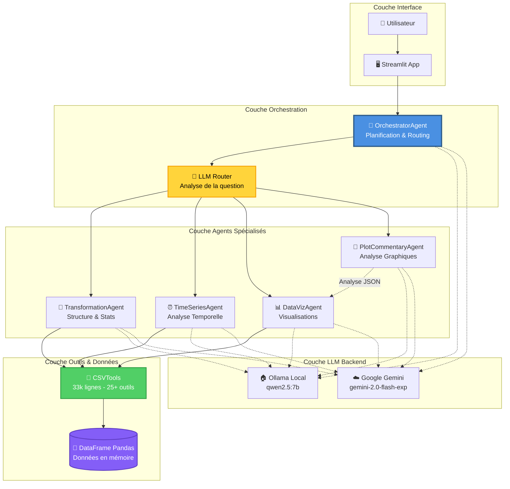
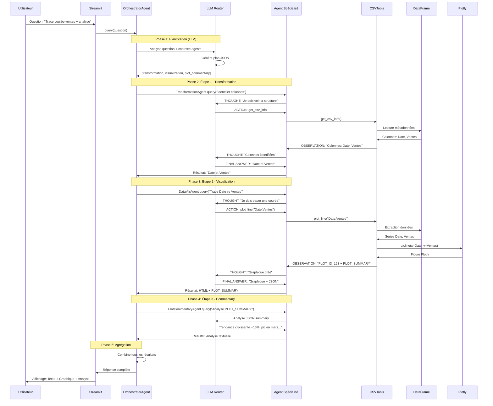

# Rapport Technique - CSV Agent Multi-Agents

## 📋 Vue d'Ensemble Technique

CSV Agent est un système d'analyse de données intelligent basé sur une **architecture multi-agents** utilisant le framework **LangChain** et des modèles de langage (LLM) pour permettre l'interrogation de fichiers CSV/Excel en langage naturel. Le système implémente le pattern **ReAct (Reasoning + Acting)** pour une analyse itérative et intelligente des données.

---

## 🏗️ Architecture Technique

### Stack Technologique

| Composant | Technologie | Version/Détails |
|-----------|-------------|-----------------|
| **Framework IA** | LangChain | Framework d'orchestration LLM |
| **Modèles LLM** | Ollama / Google Gemini | Local (Ollama) ou Cloud (Gemini) |
| **Analyse de données** | Pandas, NumPy, SciPy | Manipulation et calculs statistiques |
| **Visualisation** | Plotly, Matplotlib | Graphiques interactifs et statiques |
| **Interface Web** | Streamlit | Application web interactive |
| **Langage** | Python 3.8+ | Backend complet |

### Modèles LLM Supportés

#### 1. **Ollama (Local - Recommandé)**
- **Modèle** : `qwen2.5:7b` (7 milliards de paramètres)
- **Avantages** :
  - ✅ Gratuit et illimité
  - ✅ Exécution locale (confidentialité des données)
  - ✅ Pas de latence réseau
  - ✅ Pas de quota d'API
- **Configuration** : `http://localhost:11434`
- **Installation** : Télécharger Ollama + `ollama pull qwen2.5:7b`

#### 2. **Google Gemini (Cloud - Fallback)**
- **Modèle** : `gemini-2.0-flash-exp`
- **Avantages** :
  - ✅ Pas d'installation locale requise
  - ✅ Performances optimales
  - ✅ Mises à jour automatiques
- **Inconvénients** :
  - ❌ Nécessite une clé API Google
  - ❌ Quotas et limites de requêtes
  - ❌ Latence réseau
- **Configuration** : Variable d'environnement `GOOGLE_API_KEY`

### Système de Sélection Automatique LLM

Le système utilise une **factory intelligente** (`llm_factory.py`) qui :

1. **Détecte automatiquement** la disponibilité d'Ollama (test de connexion HTTP)
2. **Utilise Ollama en priorité** si disponible (local, gratuit)
3. **Fallback vers Gemini** si Ollama n'est pas accessible
4. **Permet le forçage** via variables d'environnement :
   - `USE_OLLAMA=true` → Force Ollama
   - `USE_GEMINI=true` → Force Gemini

```python
# Exemple de sélection automatique
llm = get_llm(
    model_name="qwen2.5:7b",  # ou "gemini-2.0-flash-exp"
    temperature=0.0,           # Déterministe pour routing
    max_output_tokens=1000,
    verbose=True
)
```

---

## 🤖 Architecture Multi-Agents

### Schéma Fonctionnel Simplifié



### Pattern ReAct (Reasoning + Acting)

Chaque agent spécialisé utilise le pattern **ReAct** de LangChain :

```
1. THOUGHT (Réflexion) : "Je dois identifier les colonnes temporelles"
2. ACTION (Action)     : Appel de l'outil detect_time_columns
3. OBSERVATION         : Résultat de l'outil
4. THOUGHT             : "Maintenant je peux calculer la tendance"
5. ACTION              : Appel de l'outil calculate_trend
6. OBSERVATION         : Résultat de la tendance
7. FINAL ANSWER        : Synthèse pour l'utilisateur
```

---

## 📦 Détail des Agents et Leurs Outils

### 1. OrchestratorAgent (Orchestrateur)

**Rôle** : Coordinateur principal qui analyse la question et planifie l'exécution

**Responsabilités** :
- Analyse de la question utilisateur via LLM
- Génération d'un plan d'exécution (1 à 3 étapes)
- Routing vers les agents spécialisés appropriés
- Agrégation des résultats de chaque étape
- Gestion du contexte entre les étapes

**Algorithme de Planification** :
```python
def _plan_agents(question: str) -> List[Dict]:
    """
    Utilise un LLM pour générer un plan JSON :
    {
      "steps": [
        {"agent": "transformation", "instruction": "Identifier colonnes"},
        {"agent": "visualization", "instruction": "Tracer courbe"},
        {"agent": "plot_commentary", "instruction": "Analyser graphique"}
      ]
    }
    """
```

**Règles de Planification** :
- ✅ Maximum 3 étapes pour éviter la complexité
- ✅ Ajoute `visualization` **uniquement** si graphique explicitement demandé
- ✅ Si colonnes non spécifiées → `transformation` d'abord
- ✅ Si `visualization` présente → ajoute `plot_commentary` après

**Outils** : Aucun (délègue aux agents spécialisés)

---

### 2. TransformationAgent (Transformation de Données)

**Rôle** : Expert en structure, statistiques et manipulation de données

**Outils Disponibles (5)** :

#### 🔧 `get_csv_info`
- **Description** : Informations générales sur le fichier
- **Input** : Vide
- **Output** : Nombre de lignes, colonnes, types de données
- **Exemple** :
  ```
  📊 Informations sur le fichier CSV:
  - Nombre de lignes : 2,075,259
  - Nombre de colonnes : 9
  Colonnes et types :
    • Date: object
    • Time: object
    • Global_active_power: float64
    • Voltage: float64
  ```

#### 🔧 `get_head`
- **Description** : Affiche les n premières lignes
- **Input** : Nombre de lignes (ex: "10")
- **Output** : DataFrame formaté
- **Utilité** : Aperçu rapide des données

#### 🔧 `get_statistics`
- **Description** : Statistiques descriptives
- **Input** : Nom de colonne (ou vide pour toutes)
- **Output** : Moyenne, médiane, écart-type, min, max, quartiles
- **Exemple** :
  ```
  📊 Statistiques pour 'Voltage':
  count    2075259.0
  mean     240.84
  std      3.24
  min      223.20
  25%      238.99
  50%      241.05
  75%      242.48
  max      254.15
  ```

#### 🔧 `count_missing_values`
- **Description** : Compte les valeurs manquantes
- **Input** : Vide
- **Output** : Nombre et pourcentage par colonne
- **Utilité** : Évaluation de la qualité des données

#### 🔧 `create_column`
- **Description** : Crée une nouvelle colonne par calcul
- **Input** : `"nom_colonne,expression"`
- **Exemples** :
  - `"total,prix * quantite"` → Multiplication
  - `"nom_complet,prenom + ' ' + nom"` → Concaténation
  - `"prix_ttc,prix * 1.2"` → Calcul avec constante
- **Technologie** : Utilise `pandas.eval()` pour expressions numériques

---

### 3. TimeSeriesAgent (Séries Temporelles)

**Rôle** : Expert en analyse temporelle, tendances et agrégations

**Outils Disponibles (6)** :

#### 🔧 `detect_time_columns`
- **Description** : Détection automatique des colonnes temporelles
- **Algorithme** :
  1. Vérifie si le type est déjà `datetime64`
  2. Cherche des mots-clés : "date", "time", "timestamp", "jour", "mois"
  3. Tente une conversion `pd.to_datetime()` sur un échantillon
- **Output** : Liste des colonnes détectées avec exemples

#### 🔧 `combine_date_time_columns`
- **Description** : Fusionne colonnes Date et Time séparées
- **Input** : `"date_col,time_col"`
- **Exemple** : `"Date,Time"` → Crée colonne `Datetime`
- **Technologie** : `pd.to_datetime()` avec `dayfirst=True` (format européen)

#### 🔧 `calculate_trend`
- **Description** : Calcul de tendance par régression linéaire
- **Input** : `"column"` ou `"column,time_column"`
- **Algorithme** : Régression linéaire via `scipy.stats.linregress()`
- **Output** :
  - Direction (📈 Croissance / 📉 Décroissance / ➡️ Stable)
  - Pente (coefficient de tendance)
  - R² (qualité de l'ajustement)
  - P-valeur (significativité statistique)
  - Variation totale en %

#### 🔧 `calculate_moving_average`
- **Description** : Moyenne mobile pour lisser les données
- **Input** : `"column,window"` ou `"column,window,time_column"`
- **Exemple** : `"Voltage,7"` → Moyenne mobile sur 7 périodes
- **Technologie** : `pandas.rolling(window).mean()`

#### 🔧 `aggregate_by_period`
- **Description** : Agrégation par période temporelle
- **Input** : `"column,period,time_column,agg_func"`
- **Périodes supportées** :
  - `D` : Jour
  - `W` : Semaine
  - `M` : Mois
  - `Q` : Trimestre
  - `Y` : Année
- **Fonctions d'agrégation** : `sum`, `mean`, `min`, `max`, `count`
- **Exemple** : `"Global_intensity,M,Date,sum"` → Somme par mois
- **Technologie** : `pandas.resample().agg()`

#### 🔧 `detect_anomalies`
- **Description** : Détection d'anomalies/outliers
- **Input** : `"column,method,threshold"`
- **Méthodes** :
  - **IQR (Interquartile Range)** : Détecte valeurs hors [Q1-1.5×IQR, Q3+1.5×IQR]
  - **Z-score** : Détecte valeurs avec |z| > seuil (défaut: 3)
- **Output** : Liste des anomalies avec pourcentage

---

### 4. DataVizAgent (Visualisation)

**Rôle** : Création de graphiques interactifs et professionnels

**Outils Disponibles (7)** :

#### 🔧 `get_csv_info` & `detect_time_columns`
- Outils partagés pour contexte

#### 🔧 `plot_line`
- **Description** : Graphique en ligne (courbes)
- **Input** : `"x_col,y_col"` ou `"x_col,y_col,hue_col"`
- **Usage** : Séries temporelles, évolutions
- **Technologie** : Plotly Express (`px.line()`)
- **Features** :
  - Fusion automatique Date+Time si détectée
  - Formatage intelligent des axes
  - Interactivité (zoom, hover, export)
- **Output** : Fichier HTML + JSON summary

#### 🔧 `plot_scatter`
- **Description** : Nuage de points
- **Input** : `"x_col,y_col"` ou `"x_col,y_col,hue_col"`
- **Usage** : Relations entre variables, corrélations visuelles
- **Technologie** : Plotly Express (`px.scatter()`)

#### 🔧 `plot_bar`
- **Description** : Graphique en barres avec agrégation
- **Input** : `"category_col,value_col"` ou `"category_col,value_col,agg_func"`
- **Fonctions d'agrégation** : `sum`, `mean`, `min`, `max`, `count`
- **Usage** : Comparaisons par catégorie, volumes par période
- **Technologie** : Plotly Express (`px.bar()`)

#### 🔧 `plot_hist`
- **Description** : Histogramme de distribution
- **Input** : `"column"` ou `"column,bins"`
- **Usage** : Distribution statistique, fréquences
- **⚠️ Important** : NE PAS utiliser pour séries temporelles (utiliser `plot_bar` à la place)
- **Technologie** : Plotly Express (`px.histogram()`)

#### 🔧 `plot_corr_heatmap`
- **Description** : Heatmap de corrélation
- **Input** : Vide (utilise toutes les colonnes numériques)
- **Technologie** : Plotly (`go.Heatmap()`)
- **Features** :
  - Calcul automatique de la matrice de corrélation
  - Échelle de couleurs divergente (rouge-blanc-bleu)
  - Annotations avec valeurs de corrélation

**Système de Registre de Plots** :
- Chaque graphique est stocké en mémoire avec un `plot_id` unique
- Génère un **PLOT_SUMMARY JSON** avec métadonnées :
  ```json
  {
    "type": "line",
    "x_column": "Date",
    "y_column": "Voltage",
    "num_points": 2075259,
    "x_range": ["2006-12-16", "2010-11-26"],
    "y_range": [223.2, 254.15],
    "trend": "increasing",
    "description": "Courbe de Voltage dans le temps"
  }
  ```

---

### 5. PlotCommentaryAgent (Analyse de Graphiques)

**Rôle** : Génère une analyse textuelle des graphiques créés

**Fonctionnement** :
1. Reçoit le **PLOT_SUMMARY JSON** du DataVizAgent
2. Utilise un LLM pour analyser les métadonnées
3. Génère un commentaire court (5-8 lignes) identifiant :
   - Tendances principales
   - Valeurs extrêmes
   - Patterns intéressants
   - Relations avec la question initiale

**Prompt Spécialisé** :
```
Tu es un analyste data. Analyse le PLOT_SUMMARY JSON fourni.
Donne une analyse courte (5-8 lignes max) :
- Tendances
- Extrêmes
- Relations
- Implications pour la question
Ne parle pas d'image, base-toi sur le JSON uniquement.
```

**Outils** : Aucun (analyse pure via LLM)

---

## 🔧 CSVTools - Bibliothèque d'Outils Partagée

**Fichier** : `csv_tools.py` (33,891 octets, 776 lignes)

### Responsabilités

1. **Chargement Intelligent** :
   - Détection automatique du séparateur CSV (`,`, `;`, `\t`)
   - Détection du format décimal (`.` ou `,`)
   - Support CSV et Excel (.xlsx, .xls)
   - Conversion automatique des nombres européens ("123,45" → 123.45)

2. **Gestion du DataFrame** :
   - Instance unique partagée par tous les agents
   - Modifications persistantes (ex: création de colonnes)
   - Optimisations mémoire pour gros fichiers

3. **Implémentation des Outils** :
   - 25+ méthodes d'analyse
   - Toutes retournent des chaînes formatées (compatibles LangChain)
   - Gestion d'erreurs robuste

### Exemple de Chargement Automatique

```python
# Détection automatique du format
with open(csv_path, 'r') as f:
    sample = f.read(4096)
    dialect = csv.Sniffer().sniff(sample)
    sep = dialect.delimiter  # Détecte ',' ou ';' ou '\t'
    
# Détection format décimal
if sep == ';':
    if re.search(r'\d+,\d+', sample):
        decimal = ','  # Format européen
        
# Chargement avec Pandas
df = pd.read_csv(csv_path, sep=sep, decimal=decimal)

# Post-traitement : conversion colonnes numériques textuelles
# "123,45" → 123.45
for col in df.select_dtypes(include=['object']).columns:
    if euro_num_pattern.match(sample_values):
        df[col] = df[col].str.replace(',', '.').astype(float)
```

---

## 📊 Workflow Technique Détaillé

### Flux d'Exécution Complet



### Gestion du Contexte Entre Étapes

```python
context_text = ""
for step in steps:
    agent = get_agent(step["agent"])
    
    # Compose la question avec contexte
    composed_question = f"""
    Contexte des étapes précédentes:
    {context_text}
    
    Instruction: {step["instruction"]}
    
    Question utilisateur: {question}
    """
    
    # Exécute l'agent
    answer = agent.query(composed_question)
    
    # Ajoute au contexte pour l'étape suivante
    context_text += f"\n\n[Étape {idx} - {step['agent']}]:\n{answer}"
```

---

## ⚙️ Configuration et Paramètres

### Fichier `config.py`

```python
class Config:
    # Modèles LLM
    MODEL_NAME = "gemini-2.0-flash-exp"  # Gemini par défaut
    OLLAMA_MODEL_NAME = "qwen2.5:7b"     # Ollama local
    OLLAMA_BASE_URL = "http://localhost:11434"
    
    # Paramètres LLM
    TEMPERATURE = 0.0          # Déterministe (routing/plan)
    MAX_ITERATIONS = 5         # Limite itérations ReAct
    TIMEOUT = 30               # Timeout en secondes
    LLM_REQUEST_DELAY = 1.5    # Délai entre appels (évite 429)
    
    # Limites spécifiques Gemini
    GEMINI_MAX_ITERATIONS = 3  # Plus restrictif pour Gemini
```

### Variables d'Environnement (`.env`)

```bash
# Clé API Google (optionnel si Ollama disponible)
GOOGLE_API_KEY=votre_cle_api_google

# Forcer un provider spécifique (optionnel)
USE_OLLAMA=true   # Force Ollama
USE_GEMINI=true   # Force Gemini
```

---

## 📈 Optimisations et Performances

### 1. Gestion des Appels LLM

**Problème** : Quotas API et erreurs 429 (Too Many Requests)

**Solutions** :
- **Délai entre appels** : 1.5s minimum (`LLM_REQUEST_DELAY`)
- **Compteur partagé** : Tracking du nombre d'appels LLM
- **Limite d'itérations** : Max 5 itérations ReAct (3 pour Gemini)
- **Retry automatique** : `max_retries=2`

```python
# Gestion du délai
time_since_last_call = time.time() - self.last_llm_call_time
if time_since_last_call < Config.LLM_REQUEST_DELAY:
    time.sleep(Config.LLM_REQUEST_DELAY - time_since_last_call)
```

### 2. Optimisation Mémoire

- **DataFrame unique** : Partagé entre tous les agents (pas de copies)
- **Lazy loading** : Chargement à la demande
- **Échantillonnage** : Détection de format sur 4096 premiers octets

### 3. Caching et Registre

- **Plot Registry** : Stockage en mémoire des graphiques générés
- **Évite régénération** : Réutilisation des plots existants

---

## 🔒 Sécurité et Robustesse

### 1. Exécution de Code

**Risque** : L'outil `create_column` utilise `eval()` pour expressions

**Mitigations** :
- **Contexte restreint** : `eval(expr, {"__builtins__": {}}, local_dict)`
- **Validation** : Vérification des colonnes avant exécution
- **Pandas eval** : Préféré pour expressions numériques (plus sûr)

### 2. Gestion d'Erreurs

- **Try-Catch généralisé** : Chaque outil gère ses exceptions
- **Messages d'erreur clairs** : Aide au debugging
- **Fallback** : Retour gracieux en cas d'échec

### 3. Validation des Données

- **Vérification des colonnes** : Avant chaque opération
- **Conversion de types** : Automatique avec gestion d'erreurs
- **Détection de valeurs manquantes** : Traitement approprié

---

## 📦 Dépendances Principales

```txt
# Framework IA
langchain>=0.1.0
langchain-ollama>=0.1.0        # Support Ollama
langchain-google-genai>=1.0.0  # Support Gemini

# Analyse de données
pandas>=2.0.0
numpy>=1.24.0
scipy>=1.10.0

# Visualisation
plotly>=5.14.0
matplotlib>=3.7.0

# Interface
streamlit>=1.28.0

# Utilitaires
python-dotenv>=1.0.0
requests>=2.31.0
openpyxl>=3.1.0  # Support Excel
```

---

## 🎯 Cas d'Usage Techniques

### Exemple 1 : Analyse Temporelle Complète

**Question** : *"Analyse la tendance des ventes sur 6 mois avec moyenne mobile et détection d'anomalies"*

**Plan généré** :
```json
{
  "steps": [
    {"agent": "time_series", "instruction": "Calculer tendance + moyenne mobile + anomalies"}
  ]
}
```

**Outils appelés** :
1. `detect_time_columns` → Identifie colonne Date
2. `calculate_trend` → Régression linéaire
3. `calculate_moving_average` → MA(7)
4. `detect_anomalies` → Méthode IQR

**Résultat** : Rapport complet avec statistiques et insights

### Exemple 2 : Visualisation Multi-Étapes

**Question** : *"Montre-moi un graphique des prix dans le temps et analyse les tendances"*

**Plan généré** :
```json
{
  "steps": [
    {"agent": "transformation", "instruction": "Identifier colonnes prix et temps"},
    {"agent": "visualization", "instruction": "Tracer courbe prix vs temps"},
    {"agent": "plot_commentary", "instruction": "Analyser le graphique"}
  ]
}
```

**Flux** :
1. **TransformationAgent** : `get_csv_info` → Identifie "Prix" et "Date"
2. **DataVizAgent** : `plot_line("Date,Prix")` → Génère graphique Plotly
3. **PlotCommentaryAgent** : Analyse PLOT_SUMMARY → "Tendance haussière +12%, pic le 15/03..."

**Résultat** : Graphique interactif + analyse textuelle détaillée

---

## 🚀 Avantages de l'Architecture

### Comparaison Mono-Agent vs Multi-Agents

| Critère | Mono-Agent | Multi-Agents |
|---------|------------|--------------|
| **Nombre d'outils par agent** | 25+ | 4-7 |
| **Longueur du prompt** | Très long | Court et ciblé |
| **Confusion LLM** | Élevée | Faible |
| **Itérations moyennes** | 5-8 | 2-4 |
| **Maintenabilité** | Difficile | Facile |
| **Extensibilité** | Complexe | Simple |
| **Performance** | Moyenne | Optimale |

### Bénéfices Techniques

1. **Spécialisation** : Chaque agent est expert dans son domaine
2. **Isolation** : Modifications d'un agent n'affectent pas les autres
3. **Scalabilité** : Ajout facile de nouveaux agents
4. **Debugging** : Traçabilité claire des étapes
5. **Optimisation** : Prompts courts = moins de tokens = plus rapide

---

## 📝 Conclusion Technique

CSV Agent représente une **architecture moderne et robuste** pour l'analyse de données par IA :

- ✅ **Framework éprouvé** : LangChain + Pattern ReAct
- ✅ **Flexibilité LLM** : Support Ollama (local) et Gemini (cloud)
- ✅ **Architecture modulaire** : Multi-agents spécialisés
- ✅ **Outils complets** : 25+ fonctions d'analyse
- ✅ **Visualisations professionnelles** : Plotly interactif
- ✅ **Performances optimisées** : Gestion intelligente des appels LLM
- ✅ **Robustesse** : Gestion d'erreurs et validation

Le système est **production-ready** et peut être déployé pour des cas d'usage réels d'analyse de données en entreprise.
